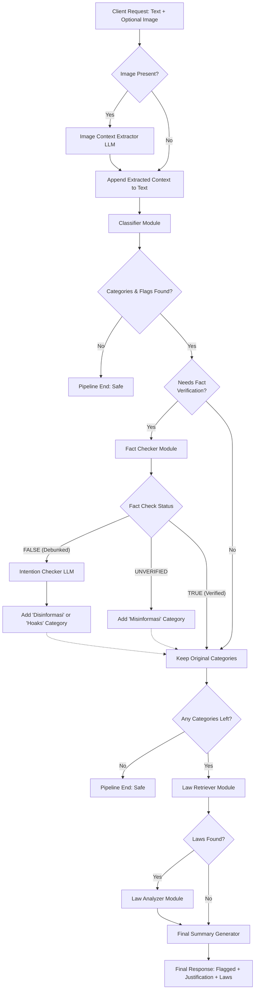
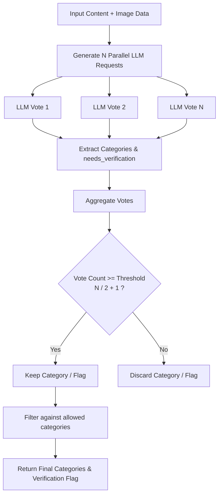
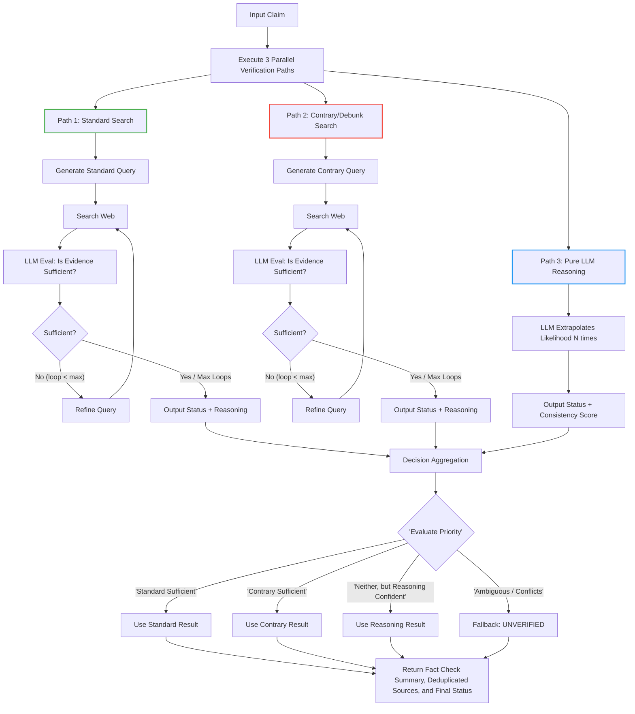
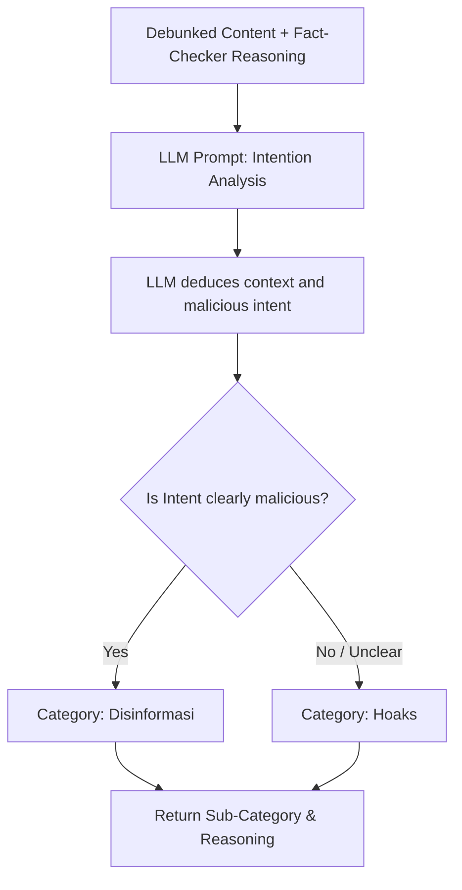
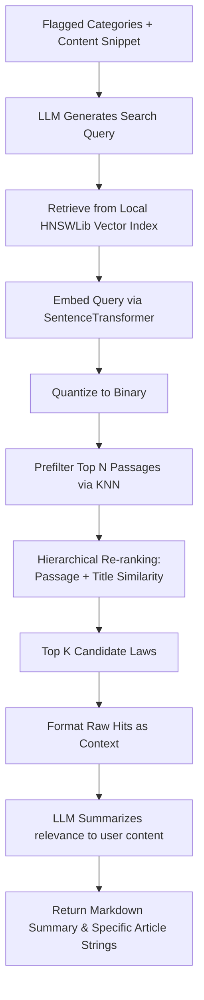
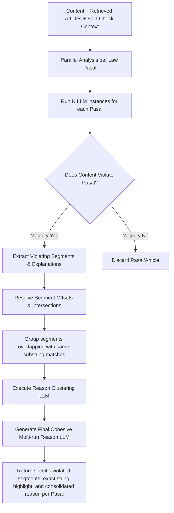

# **Queeree Pipeline Flow**

This document outlines the data flows and logic of the pipeline. It roughly comprehensively-covers the high-level orchestration flow, followed by detailed breakdowns of each internal component. Some parts are simplified down a bit, but considering the complexity of the current codebase, honestly, I think this is comprehensive enough for most purposes.

The design rationale of this pipeline is to be able to be as llm-agnostic as possible while leveraging as much of the available retrieval tooling to assist and augment the capability of whatever model is loaded up. Preferably, we're using a reasoning-trained model for the LLM, but any VLM is compatible with this pipeline and can be swapped out relatively easily within the codebase to support an ensemble of models to handle the two modalities. (e.g., using a VLM for MLLM task, whilst the reasoning and textual ones are handled by a text-only LLM)

Crucially, we implemented this under the assumption that it'd prove more beneficial to, instead of tuning a model for classification of DFK tasks, instead emulate a content moderation agent through automated queries. We posit that the inductive bias of the DFK task is _not_ for the "detection", rather it would be more on the "reasoning" and "verification" of facts in the matter at hand, thus the training of the LLM may prove counterproductive to the core objective, that is verifying, and through that, _identifying_ cases of DFK. Note that tuning within this framework _can_ still be done, most particularly in the embedding models used, but all in all, again, it was designed to be as model-agnostic as possible.

---

## 1. General System Overview

The orchestrator (`app/pipeline/orchestrator.py` & `app/main.py`) acts as the entry point for requests and coordinates various specialized modules (extraction, classification, fact-checking, and legal analysis). The progress is then streamed to the client via Server-Sent Events (SSE).

---

## 2. Classifier Flow

The classifier (`app/pipeline/classifier.py`) runs parallel LLM calls to determine categorical violations. It resolves disagreement by taking a simple majority vote.

---

## 3. Fact-Checker Flow

When the classifier flags claims as needing verification, the fact checker (`app/pipeline/fact_checker.py`) executes three independent parallel paths. It utilizes a web scraper (`app/pipeline/retrieval.py`) to gather real-world evidence and acts iteratively if the gathered evidence is insufficient.

---

## 4. Intention Checker Flow

Used exclusively if a claim is explicitly debunked (FALSE). The Intention Checker (`app/pipeline/intention_checker.py`) evaluates _why_ the false claim exists, distinguishing between coordinated malice ('Disinformasi') and casual misinformation/rumors ('Hoaks').

---

## 5. Law Retriever Flow

To ground moderation decisions, relevant Indonesian laws are searched locally (`app/pipeline/law_retriever.py`) and summarized.

---

## 6. Law Analyzer Flow

When specific laws are found, the system performs a localized sentence-by-sentence analysis (`app/pipeline/law_analyzer.py`) to pinpoint exactly _which parts of the user content_ violated the law, and aggregates reasoning consensuses.

